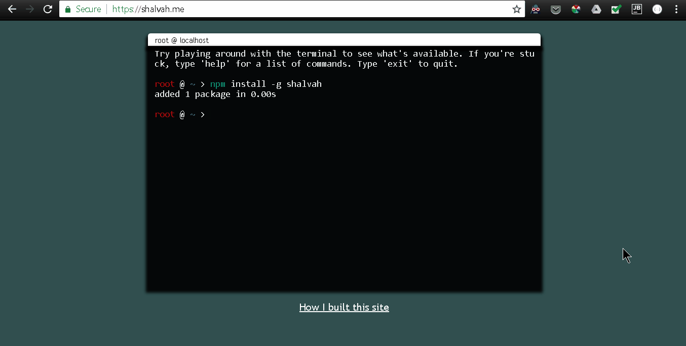

# shalvah.me

Source of [my personal site](https://shalvah.me).

I built this using [Xterm.js](https://xtermjs.org/) for the command-line UI, and [Commander.js](https://github.com/tj/commander.js/), [Inquirer.js](https://github.com/SBoudrias/Inquirer.js/), and [Chalk](https://github.com/chalk/chalk/) for the CLI utilities. These last three are primarily designed for Node.js, so I used [Browserify](https://github.com/browserify/browserify) (with the [Aliasify transform](https://github.com/benbria/aliasify)) to hack around that.

Finally, I plugged in [shalvah](http://github.com/shalvah/shalvah), my SaaNP (Site-as-an-NPM-Package —okay, I coined that) for the content.

[Here's a post on how I built this.](https://dev.to/shalvah/i-was-bored-so-i-made-my-website-into-a-node-package-heres-how-2id3) 

Thanks for dropping by! [Say hi on Twitter](https://twitter.com/intent/tweet?text=Hey%20@theshalvah) if you like it!
